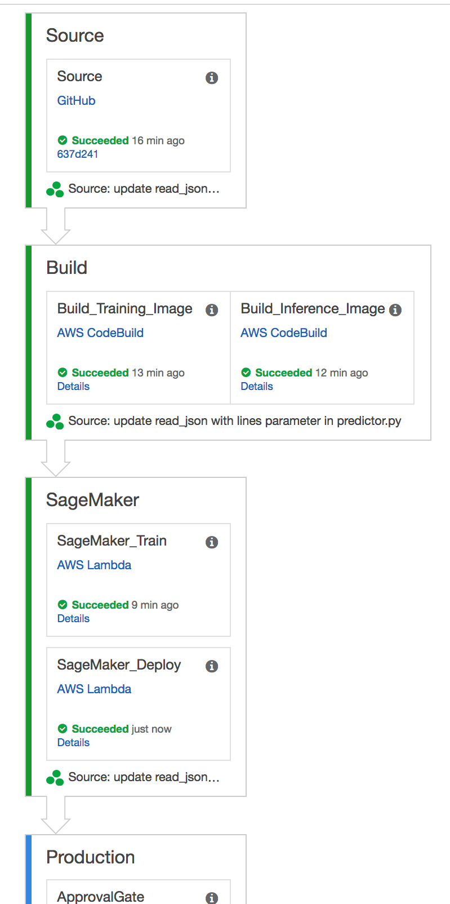

## CICD Pipeline for Deploying AI/ML Microservice using Amazon SageMaker


### Project Summary

The aim of this project is to present a minimum viable machine learning pipeline for training and hosting a custom Machine Learning/Deep Learning model in python with a REST endpoint exposed for inference.
This pipeline continuously builds training and inference docker image for your custom model and then invokes a SageMaker job to train it and after training deploys an SageMaker enpoint for inferece.
The pipeline resources can be provisioned in AWS by creating a CloudFormation stack from the template provided here: [*template/sagemaker-pipeline.yaml*](https://github.com/MustafaWaheed91/sagemaker-pipeline/blob/master/template/sagemaker-pipeline.yaml)

The pipeline is executed whenever
* A new commit is pushed to the Github repository branch you specify in the CloudFormation template
* A data or config objects are created or updated in the training input bucket under the S3 key */input*

**Note**: This pipeline consumes code in the github repository branch that is laid out as a python package with a setup.py file in the root of the repository along with the module folder.

----

### Step 1: Setup AWS Account

Make sure you have an AWS account. You should also make sure that you have AWS CLI installed and configured.

**Note**: You may incur a charge for use of underlying resources

----

### Step 2: Package Model

In order to use this pipeline its expected that your model algorithm is packaged up like a python module and uploaded to a Github repository, as seen below:


To learn more about packaging python code [see here](https://python-packaging.readthedocs.io/en/latest/). Also **please note** that you would need to get a personal access token for the pipeline to link to your source repo in Github.

Check out [this repository](https://github.com/MustafaWaheed91/tf-gamesbiz) as an example of a packaged python model that can be consumed by this pipeline.
Feel free to clone [this repository](https://github.com/MustafaWaheed91/tf-gamesbiz) and the packaged module "gamesbiz" inside.

**Note**: The the training algorithm is in the module *train.py* implemented as a function named "entry_point()" and the inference code is in *serve.py* with its entrypoint function also specified in setup.py

As you can see the root level of your Github repo has a *setup.py* file present there along with the package module directory (as is convention).
In order to use this CICD pipeline with your packaged python code you need to add an "entry_points" argument in your *setup.py* file in the "setup()" function.

This additional "entry_points" argument provides all the information the pipeline needs to build a SageMaker compatible docker image.
You can see this in the *setup.py* file for the [example repo](https://github.com/MustafaWaheed91/tf-gamesbiz) where the function is named "entry_point()" as well.

Make sure to keep "train" and "serve" keywords on the LHS of the "=" when specifying the entry point string as seen in the juxtaposition below.

```
setup(

    ....

    entry_points={
       "gamesbiz.training": [
           "train=gamesbiz.train:entry_point",
       ],
       "gamesbiz.hosting": [
           "serve=gamesbiz.server:start_server",
       ]
    }

    ....
)

```

```
setup(

    ....

    entry_points={
        "<PACKAGE NAME>.<ENTER ANY TEXT>" : [
            "train = <ENTER MODULE PATH TO FUNCTION TO BE INVOKED>:<ENTER NAME OF FUNCTION>"
        ]
        "<PACKAGE NAME>.<ENTER ANY TEXT>" : [
            "serve = <ENTER MODULE PATH TO FUNCTION TO BE INVOKED>:<ENTER NAME OF FUNCTION>"
        ]
    }

    ....

)

```


----

### Step 3: Launch Pipeline Stack

To launch the pipeline open up your terminal and do the following:

```
git clone https://github.com/MustafaWaheed91/sagemaker-pipeline.git

cd sagemaker-pipeline

chmod +x launch-cicd-pipeline.sh

# Edit the lauch-cicd-pipeline.sh script with your own model repo info

./launch-cicd-pipeline.sh

```
You **can edit any of the following variables** in *launch-cicd-pipeline.sh* as you see appropriate for your own instance of the pipeline stack for your own Github repository and code.

```
AWS_DEFAULT_REGION="<ENTER AWS REGION>"
Email="<ENTER EMAIL ADDRESS FOR PIPELINE NOTIFICATION>"

# Parameters to Configure Specific Github Repo
GitHub_User="<ENTER YOUR GITHUB USER NAME>"
GitHub_Repo="<ENTER NAME (ONLY) OF GITHUB REPOSITORY>"
GitHub_Branch="<ENTER NAME OF GIT BRANCH THAT WILL TRIGGER PIPELINE>"
GitHub_Token="<ENTER GITHUB PERSONAL ACCESS TOKEN>"

# CodeBuild Project Parameters
Python_Build_Version="aws/codebuild/python:3.6.5-1.3.2"
Build_Timeout_Mins=30

# SageMaker Training Job Parameters
Instance_Count=1
Instance_Type="ml.m4.4xlarge"
Max_Runtime_In_Seconds=86400
Vol_In_GB=30

Template_Name="${GitHub_Repo}-cicd-pipeline"
Lambdas_Bucket="${Template_Name}-lambdas-`date '+%Y-%m-%d-%H-%M-%S'`"
Lambdas_Key="SageMakerTrigger/LambdaFunction.zip"

...

```

You can monitor stack creation on AWS CloudFormation console.

Once the pipeline stack has been successfully provisioned. Check the outputs tab for this stack while on the CloudFormation console.
There you will find links to the following resources:

* **PipelineUrl**: with an URL link to the CodePipeline execution page
* **TrainingInputBucket**: with an URL link to the S3 input bucket
* **ModelArtifactBucket**: with an URL link to the S3 bucket where SageMaker uploads the model output artifact.
* **MetaDataStore**: with an URL link to the DynamoDB table tracking the meta data for each execution for your pipeline.

**Note**: During stack creation you will receive an email to the address you specified in CloudFormation template to subscribe to the SNS topic notifying you when your SageMaker training job finishes

----

### Step 4: Interact with Pipeline

You can trigger the pipeline by:

* Uploading new data to the *TrainingInputBucket* under the 'input/data/' key prefix, or by
* Pushing a commit to the Github repository branch that the pipeline was configured for

Once the SageMaker Training Job finishes and model artifact is pushed to the *ModelArtifactBucket* in S3.

You can track the git hash, input data object version(s) along with SageMaker Training Job status/meta data in DynamoDB table
which is the *MetaDataStore* in the stack output.

Click on the link associated with *PipelineUrl* to see the pipeline execution details as seen below:



----

### Step 5: Delete Pipeline Stack

To tear down the pipeline resources just delete the CF stack from the cloud formation console.

**Note**: The S3 buckets and the ECR repository are not deleted when deleting this pipelines CloudFormation stack.

----

### Assumptions

1. Some familiarity with packaging code in python is assumed
2. Familiarity with Machine Learning is also assumed
3. Know how to generate a Personal Access Token in Github


## Built With

* [AWS CodePipeline](https://aws.amazon.com/codepipeline/) - Continous Integration Service
* [AWS CodeBuild](https://aws.amazon.com/codebuild/) - Fully Managed Build and Test Service
* [Amazon SageMaker](https://aws.amazon.com/sagemaker/) - Machine Learning Framework that Scales
* [Amazon S3](https://aws.amazon.com/s3/) - Simple Storage Service
* [Amazon DynamoDB](https://aws.amazon.com/dynamodb/) - Non Relational Database
* [AWS Lambda](https://aws.amazon.com/lambda/) - Serverless Compute Service


## Author

* **Mustafa Waheed** - *Data Scientist*